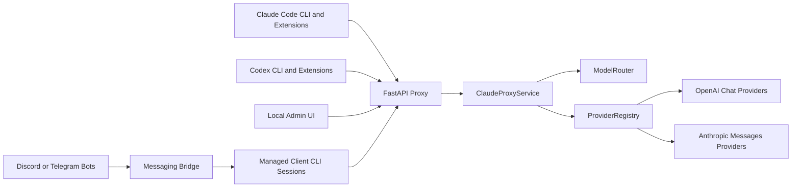
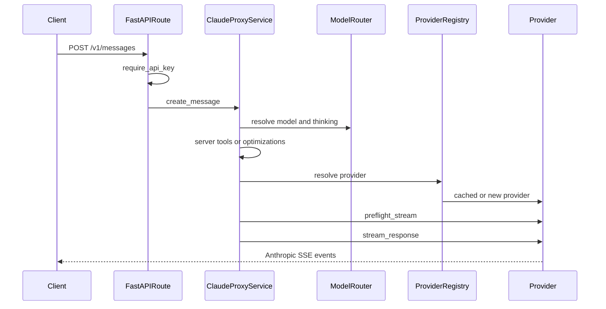
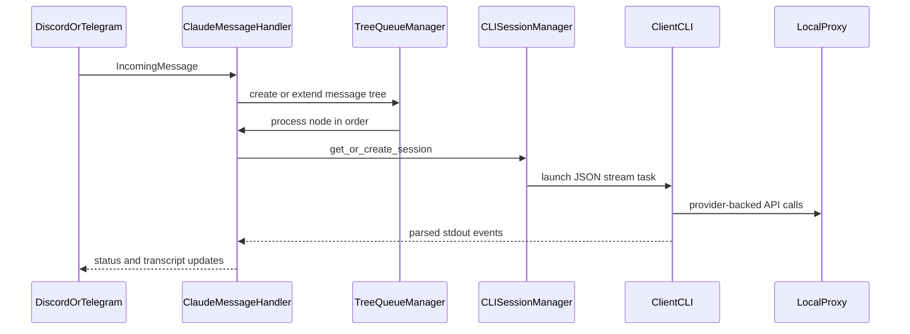

# Architecture

This document is a maintainer-oriented map of Free Claude Code. It explains the
runtime boundaries, request flows, provider abstraction, configuration model,
optional messaging bridge, and verification strategy.

For installation, provider setup, and user-facing usage, see
[README.md](README.md). This file focuses on where behavior lives in the codebase
and how contributors should extend it.

## System Overview

Free Claude Code is a local proxy for agent clients. It accepts Anthropic
Messages traffic from Claude Code clients and OpenAI Responses traffic from Codex
clients, routes the request to a configured upstream provider, and preserves the
wire protocol expected by the caller.

There are three runtime surfaces:

- HTTP proxy: FastAPI routes expose Anthropic-compatible, Responses-compatible,
  health, model-listing, stop, and admin endpoints.
- CLI launchers: wrapper entrypoints prepare Claude Code and Codex environments
  so they target the local proxy.
- Messaging bridge: optional Discord or Telegram adapters turn chat messages
  into managed client CLI sessions.



## Package Boundaries

The installable wheel packages are declared in [pyproject.toml](pyproject.toml):

- [api/](api/) owns the FastAPI app, route handlers, request orchestration,
  admin APIs, local optimizations, and server-tool handling.
- [cli/](cli/) owns console entrypoints, client CLI launchers, process/session
  management, and client adapter contracts.
- [config/](config/) owns settings, provider metadata, filesystem paths,
  logging setup, constants, and provider ID catalogs.
- [core/](core/) owns provider-neutral protocol logic: Anthropic conversion,
  SSE construction, OpenAI Responses conversion, stream recovery, token counting,
  and structured trace helpers.
- [messaging/](messaging/) owns optional platform adapters, incoming message
  handling, tree queues, transcript rendering, persistence, commands, and voice
  support.
- [providers/](providers/) owns provider construction, shared provider base
  classes, upstream transports, rate limiting, model listing, and concrete
  provider adapters.

[tests/](tests/) contains deterministic unit and contract coverage.
[smoke/](smoke/) contains local and live product smoke tests that can launch
subprocesses or touch real services.

The main ownership rule is that shared Anthropic and Responses protocol behavior
belongs in [core/](core/). Provider modules should use neutral helpers rather
than importing behavior from another provider-specific module.

## Design Pressure And Refactor Targets

The current package boundaries are intentional, but several modules still carry
large orchestration responsibilities. Treat these as refactor targets, not as
new places to add unrelated behavior:

- [api/services.py](api/services.py) coordinates routing, optimizations, local
  server tools, provider execution, and Responses adaptation. Future changes
  should keep route handlers thin and move separable use-case logic behind small
  helpers.
- [providers/openai_compat.py](providers/openai_compat.py) and
  [providers/anthropic_messages.py](providers/anthropic_messages.py) still own
  provider-specific stream parsing, request construction, and recovery event
  construction. Shared protocol rules should continue moving toward
  [core/](core/) when they are not provider-specific.
- [messaging/handler.py](messaging/handler.py) owns command dispatch, tree
  queueing, CLI session execution, transcript updates, and persistence
  coordination. New platform-specific behavior should stay in platform or
  rendering modules.
- [api/admin_config.py](api/admin_config.py) owns the admin config manifest,
  validation, env rendering, and status metadata. Keep it data-driven, and split
  only around cohesive admin responsibilities.

## Runtime Startup And Lifecycle

Console scripts are registered in [pyproject.toml](pyproject.toml):

- `fcc-server` and `free-claude-code` call `cli.entrypoints:serve`.
- `fcc-init` calls `cli.entrypoints:init`.
- `fcc-claude` calls `cli.entrypoints:launch_claude`.
- `fcc-codex` calls `cli.entrypoints:launch_codex`.

[scripts/install.sh](scripts/install.sh) and [scripts/install.ps1](scripts/install.ps1)
install or update the uv tool plus optional voice extras. [scripts/uninstall.sh](scripts/uninstall.sh)
and [scripts/uninstall.ps1](scripts/uninstall.ps1) remove only the FCC uv tool and always
delete the managed `~/.fcc/` tree from [config/paths.py](config/paths.py); they do not remove
uv, Claude Code, Codex, or uv-managed Python runtimes. [scripts/ci.sh](scripts/ci.sh) and
[scripts/ci.ps1](scripts/ci.ps1) mirror [.github/workflows/tests.yml](.github/workflows/tests.yml)
for local pre-push verification.

[cli/entrypoints.py](cli/entrypoints.py) starts the FastAPI server with Uvicorn.
`serve()` migrates legacy env files when needed, loads cached settings, runs a
supervised server instance, and can restart the server after admin config changes.
On final shutdown it best-effort kills registered child processes.

[api/app.py](api/app.py) builds the FastAPI application. `create_app()` configures
logging, registers admin and API routers, attaches HTTP correlation metadata, and
installs exception handlers for validation failures, provider errors, and
unexpected errors. `GracefulLifespanApp` wraps the app so startup failures are
reported without noisy Starlette tracebacks.

[api/runtime.py](api/runtime.py) owns process-lifetime resources through
`AppRuntime`:

- creates and publishes an app-scoped `ProviderRegistry`;
- validates configured models best-effort without blocking first-run admin access;
- starts provider model-list refresh;
- starts optional Discord or Telegram messaging when configured;
- publishes messaging, CLI, and provider state onto `app.state`;
- shuts down messaging platforms, CLI sessions, provider transports, and rate
  limiters with bounded best-effort cleanup.

## Configuration Model

[config/settings.py](config/settings.py) centralizes configuration with Pydantic
Settings. Dotenv files are configured in this order:

1. repo-local `.env`;
2. managed `~/.fcc/.env`;
3. optional `FCC_ENV_FILE`, appended when present.

Later dotenv files override earlier dotenv files. Process environment variables
also participate through Pydantic settings resolution. `ANTHROPIC_AUTH_TOKEN`
has an extra guard after settings are built: if any configured dotenv file
defines it, that dotenv value replaces a stale inherited shell token.

[config/paths.py](config/paths.py) defines managed paths:

- config directory: `~/.fcc`;
- managed env file: `~/.fcc/.env`;
- generated Codex model catalog: `~/.fcc/codex-model-catalog.json`;
- agent workspace: `~/.fcc/agent_workspace`;
- server log: `~/.fcc/logs/server.log`.

Model routing configuration is tiered:

- `MODEL` is the fallback provider-prefixed model ref.
- `MODEL_OPUS`, `MODEL_SONNET`, and `MODEL_HAIKU` override Claude model tiers.
- `ENABLE_MODEL_THINKING` is the global thinking switch.
- `ENABLE_OPUS_THINKING`, `ENABLE_SONNET_THINKING`, and
  `ENABLE_HAIKU_THINKING` optionally override thinking by tier.

[api/admin_config.py](api/admin_config.py) defines the Admin UI config manifest
and writes managed env updates. [api/admin_routes.py](api/admin_routes.py)
exposes local-only admin endpoints that load, validate, apply, and test config.
After an apply, settings are cache-cleared. Depending on the changed fields, the
server either replaces the app provider registry or asks the supervised server to
restart.

Admin routes call `require_loopback_admin()`, which rejects non-loopback clients
and non-local origins.

## HTTP Request Flow

[api/routes.py](api/routes.py) exposes the public proxy routes:

- `POST /v1/messages`: Anthropic Messages-compatible streaming requests.
- `POST /v1/responses`: OpenAI Responses-compatible requests.
- `POST /v1/messages/count_tokens`: Anthropic token counting.
- `GET /v1/models`: gateway and Claude-compatible model listing.
- `GET /health`: health check.
- `POST /stop`: stop CLI sessions and pending tasks.
- `HEAD` and `OPTIONS` probes for compatibility on supported endpoints.

Admin routes live beside these in [api/admin_routes.py](api/admin_routes.py).

Authentication is handled by `require_api_key()` in
[api/dependencies.py](api/dependencies.py). If `ANTHROPIC_AUTH_TOKEN` is blank,
proxy auth is disabled. Otherwise the token may be supplied through `x-api-key`,
`Authorization: Bearer ...`, or `anthropic-auth-token`. Comparisons use
constant-time matching.

`ClaudeProxyService` in [api/services.py](api/services.py) coordinates request
handling. It validates non-empty messages, resolves models, handles local server
tools and optimizations, resolves a provider, preflights the upstream request,
then streams Anthropic SSE back to the caller.



OpenAI Responses uses the same core route. `create_response()` converts the
Responses payload into an Anthropic Messages payload with
[core/openai_responses/conversion.py](core/openai_responses/conversion.py),
reuses `create_message()`, then converts the final response or SSE stream back to
Responses format.

## Model Routing

[api/model_router.py](api/model_router.py) resolves incoming client model names.
It supports two forms:

- Direct provider model refs such as `nvidia_nim/nvidia/model-name`.
- Gateway model IDs decoded by [api/gateway_model_ids.py](api/gateway_model_ids.py).

If the incoming model is not direct, `Settings.resolve_model()` maps it by Claude
tier. Names containing `opus`, `sonnet`, or `haiku` use the matching tier override
when set, otherwise they fall back to `MODEL`.

The router also resolves thinking. Gateway model IDs can force thinking on or
off; otherwise `Settings.resolve_thinking()` applies tier-specific thinking
overrides or the global setting.

`GET /v1/models` advertises:

- configured provider model refs;
- cached provider-discovered models;
- no-thinking variants when appropriate;
- built-in Claude model IDs for compatibility with Claude clients.

Provider model discovery is app-scoped through `ProviderRegistry`, which caches
model IDs and optional thinking capability metadata for the model-list route and
admin status.

Codex-specific model picker shaping stays out of this route. `fcc-codex` fetches
the same `/v1/models` response at launch, converts FCC gateway IDs into
provider-selectable Codex slugs, writes `~/.fcc/codex-model-catalog.json`, and
passes it as `model_catalog_json`. Codex users open the native picker with
`/model`; FCC does not implement a proxy-level `/models` alias.

## Provider Architecture

Provider metadata is neutral and centralized in
[config/provider_catalog.py](config/provider_catalog.py). Each
`ProviderDescriptor` declares provider ID, transport type, capabilities,
credential env var, default base URL, settings attribute names, and proxy support.

[providers/registry.py](providers/registry.py) owns provider factories and the
runtime registry. It validates that descriptors, factories, and supported IDs are
in sync, builds shared `ProviderConfig`, checks required credentials, creates
providers lazily, caches them, refreshes model lists, and cleans up transports.

[providers/base.py](providers/base.py) defines:

- `ProviderConfig`: shared provider settings such as API key, base URL, rate
  limits, timeouts, proxy, thinking, and logging flags.
- `BaseProvider`: the provider interface for cleanup, model listing, preflight,
  and `stream_response()`.

There are two transport families:

- [providers/openai_compat.py](providers/openai_compat.py) implements
  `OpenAIChatTransport` for providers with OpenAI-compatible
  `/chat/completions` APIs. These providers convert Anthropic messages and tools
  into OpenAI chat payloads, then rebuild Anthropic SSE events.
- [providers/anthropic_messages.py](providers/anthropic_messages.py) implements
  `AnthropicMessagesTransport` for providers with Anthropic-compatible
  `/messages` APIs. These providers can send more of the Anthropic request shape
  natively while still enforcing local stream and error contracts.

Shared provider responsibilities include upstream rate limiting, model listing,
safe error mapping, transport cleanup, thinking/tool handling, retry or recovery
where supported, and returning Anthropic SSE strings to the service layer.

### Adding A Provider

1. Add provider metadata to [config/provider_catalog.py](config/provider_catalog.py).
2. Add credentials and related settings to [config/settings.py](config/settings.py)
   and [.env.example](.env.example) when user configurable.
3. Add admin manifest fields in [api/admin_config.py](api/admin_config.py) when
   the setting should be editable in the Admin UI.
4. Implement the provider under [providers/](providers/) using the appropriate
   shared transport family.
5. Add a factory in [providers/registry.py](providers/registry.py).
6. Add deterministic tests under [tests/providers/](tests/providers/) and any
   relevant contract tests.
7. Add smoke coverage or smoke config in [smoke/](smoke/) when the provider can
   be exercised live.
8. Update user-facing provider docs in [README.md](README.md) when users need new
   setup instructions.

## Protocol Conversion And Streaming Contracts

[core/anthropic/](core/anthropic/) owns Anthropic-side protocol behavior:

- content and message conversion for OpenAI-compatible upstreams;
- tool schema and tool-result handling;
- thinking block handling;
- SSE event formatting through `SSEBuilder`;
- native Anthropic stream policy;
- stream recovery policy, holdback, continuation, and repair helpers;
- token counting and user-facing error formatting.

Shared stream recovery policy lives in
[core/anthropic/stream_recovery_session.py](core/anthropic/stream_recovery_session.py)
and [core/anthropic/stream_recovery.py](core/anthropic/stream_recovery.py). The
shared layer owns early retry classification, holdback buffering, retry attempt
counting, and common flush/discard behavior. Provider transports still own
upstream request construction, stream semantic parsing, transport-specific state
tracking, and the actual recovery SSE events emitted for OpenAI-chat or native
Anthropic streams.

[core/openai_responses/](core/openai_responses/) owns OpenAI Responses support:

- Responses request conversion into Anthropic Messages payloads;
- Anthropic message response conversion into Responses objects;
- Anthropic SSE conversion into Responses SSE;
- OpenAI-compatible error envelopes.

Responses reasoning is handled as protocol conversion, not provider policy.
`reasoning.effort = "none"` converts to a disabled Anthropic `thinking`
request; any other explicit Responses reasoning request enables Anthropic
thinking without translating OpenAI effort names into Anthropic token budgets.
Prior Responses `reasoning` input items replay plaintext `reasoning_text`, or
fallback `summary_text`, into assistant `reasoning_content`. Encrypted reasoning
input is ignored because the proxy cannot decrypt it.

Provider thinking output maps back to Responses reasoning in the same block
order the upstream Anthropic stream produced. Anthropic `thinking` blocks become
Responses `reasoning` output items and `response.reasoning_text.*` stream
events. Anthropic `redacted_thinking` becomes a Responses `reasoning` item with
`encrypted_content`; the opaque value is not exposed as visible text and FCC
does not synthesize reasoning summaries.

Provider code should delegate protocol details to these modules. Avoid copying
conversion code into individual providers, and avoid provider-to-provider imports
for shared Anthropic behavior.

## Local Optimizations And Server Tools

[api/optimization_handlers.py](api/optimization_handlers.py) short-circuits
common low-value client requests before they reach a provider:

- quota probes;
- command prefix detection;
- title generation;
- suggestion mode;
- filepath extraction.

The service runs these only after model routing and after local server-tool
handling. Each optimization is controlled by settings flags.

Local `web_search` and `web_fetch` handling lives under
[api/web_tools/](api/web_tools/). When `ENABLE_WEB_SERVER_TOOLS` is true, the
service can stream local Anthropic server-tool responses without sending the
request upstream. [api/web_tools/egress.py](api/web_tools/egress.py) enforces URL
scheme and private-network restrictions for `web_fetch`.

OpenAI-chat upstream providers are identified by
`ProviderDescriptor.transport_type == "openai_chat"` in
[config/provider_catalog.py](config/provider_catalog.py). They cannot safely
represent Anthropic server-tool blocks, so the service rejects unsupported
server-tool requests before provider execution instead of performing a lossy
conversion. Forced `web_search` or `web_fetch` requests are handled locally when
`ENABLE_WEB_SERVER_TOOLS` is true; otherwise OpenAI-chat upstreams reject them
and native Anthropic Messages transports may receive them.

## CLI Launchers And Client Adapter Boundary

[cli/adapters/base.py](cli/adapters/base.py) defines `ClientCliAdapter`, the
boundary for building subprocess commands, building launcher environments,
parsing stdout lines, and extracting persistent session IDs.

[cli/adapters/claude.py](cli/adapters/claude.py) implements the Claude Code
adapter:

- `fcc-claude` strips inherited `ANTHROPIC_*` variables, sets
  `ANTHROPIC_BASE_URL`, enables gateway model discovery, configures the
  auto-compact window, and forwards `ANTHROPIC_AUTH_TOKEN` when configured.
- Managed task invocations set `ANTHROPIC_API_URL`, `ANTHROPIC_BASE_URL`,
  gateway model discovery, non-interactive terminal settings, optional
  `--resume`, optional `--fork-session`, and `--output-format stream-json`.

[cli/adapters/codex.py](cli/adapters/codex.py) implements the Codex adapter:

- `fcc-codex` strips official OpenAI and Codex credential variables.
- It creates an ephemeral `fcc` model provider with `wire_api = "responses"` and
  a base URL pointing at the local proxy `/v1` path.
- After proxy health succeeds, it fetches `/v1/models`, writes a generated Codex
  `model_catalog_json` file under `~/.fcc/`, and injects that path so Codex's
  native `/model` picker lists FCC provider slugs. Catalog generation is
  fail-open: launch continues with a warning if the catalog cannot be prepared.
- It stores the proxy auth token in `FCC_CODEX_API_KEY` for Codex to read.
- Managed task invocations use Codex JSON output and map Responses events into
  the messaging parser event shape.
- Codex `response.reasoning_text.delta` events are converted into the shared
  Anthropic-style `thinking_delta` parser shape; summary reasoning events remain
  raw unless a future feature selects them as the proxy wire shape.

[cli/manager.py](cli/manager.py) coordinates multiple `CLISession` instances so
separate conversations can run in separate client CLI processes while replies
reuse or fork existing sessions.

## Messaging Architecture

Messaging is optional. [api/runtime.py](api/runtime.py) calls
`create_messaging_platform()` from
[messaging/platforms/factory.py](messaging/platforms/factory.py) during startup.
If `MESSAGING_PLATFORM` is `none`, or if the selected platform token is missing,
the messaging bridge is skipped.

[messaging/handler.py](messaging/handler.py) contains `ClaudeMessageHandler`, the
platform-agnostic orchestration layer. It receives `IncomingMessage` objects,
dispatches commands, filters its own status messages, creates or extends a
message tree, queues work, runs a managed client CLI session, parses CLI events,
updates transcripts, and persists conversation state.

[messaging/trees/queue_manager.py](messaging/trees/queue_manager.py) preserves
per-conversation ordering with tree-aware queues. Replies become child nodes, and
each tree processes one node at a time while separate trees can progress
independently.

[messaging/session.py](messaging/session.py) persists trees, node-to-tree
mappings, and message IDs to a JSON file under the managed agent workspace. It
uses debounced atomic writes and flushes pending saves on shutdown.



## Observability, Diagnostics, And Safety

[core/trace.py](core/trace.py) emits structured trace events across stages such
as ingress, routing, provider, egress, messaging, and client CLI execution. Trace
payloads are intended to connect API, provider, CLI, and messaging activity
without requiring raw transport logs by default.

Logging defaults are conservative:

- API payloads and SSE events are not logged raw unless explicitly enabled.
- Provider and application errors log metadata by default; verbose traceback and
  message logging are opt-in.
- Messaging text, transcription previews, CLI diagnostics, and detailed
  messaging exception strings are controlled by separate diagnostic flags.
- Values under keys that look like API keys, authorization, tokens, or secrets
  are redacted by trace helpers where structured traces are emitted.

Important safety boundaries:

- Admin UI and admin APIs are loopback-only.
- Proxy API auth is controlled by `ANTHROPIC_AUTH_TOKEN`.
- `web_fetch` egress defaults to configured URL schemes and blocks private
  network targets unless explicitly allowed.
- Local provider URLs are user-configurable, but local-provider status checks are
  exposed only through the local admin API.

## Testing And CI Strategy

Deterministic tests live under [tests/](tests/). They cover API routes, config,
provider conversion, provider transports, streaming contracts, messaging, CLI
adapters, import boundaries, provider catalog contracts, and other invariants.

Live and local product tests live under [smoke/](smoke/). See
[smoke/README.md](smoke/README.md) for target taxonomy, environment variables,
failure classes, and examples. Smoke tests can launch subprocesses, call real
providers, touch local model servers, and optionally send bot messages.

CI is defined in [.github/workflows/tests.yml](.github/workflows/tests.yml). It
enforces:

- `Ban type ignore suppressions`;
- `ruff-format`;
- `ruff-check`;
- `ty`;
- `pytest`.

Contributor verification commands:

```powershell
uv run ruff format
uv run ruff check
uv run ty check
uv run pytest
```

For docs-only architecture changes, a source-link and accuracy review is usually
sufficient. Full CI can still be run when the doc accompanies runtime changes or
when maintainers want branch-level assurance.

## Extension Checklists

### Add An Admin Setting

1. Add or expose the setting in [config/settings.py](config/settings.py).
2. Add the template key to [.env.example](.env.example) if users configure it.
3. Add a `ConfigFieldSpec` in [api/admin_config.py](api/admin_config.py).
4. Mark `restart_required` or `session_sensitive` when runtime state cannot be
   updated in place.
5. Add tests under [tests/api/](tests/api/) or [tests/config/](tests/config/).

### Add A Client Adapter

1. Implement the `ClientCliAdapter` protocol from
   [cli/adapters/base.py](cli/adapters/base.py).
2. Register selection behavior in [cli/adapters/registry.py](cli/adapters/registry.py).
3. Ensure launcher env construction strips conflicting upstream credentials.
4. Ensure managed task parsing emits the event shapes expected by
   [messaging/event_parser.py](messaging/event_parser.py) and
   [messaging/node_event_pipeline.py](messaging/node_event_pipeline.py).
5. Add CLI adapter and session-manager tests under [tests/cli/](tests/cli/).

### Add A Messaging Platform

1. Implement `MessagingPlatform` from
   [messaging/platforms/base.py](messaging/platforms/base.py).
2. Add construction logic to
   [messaging/platforms/factory.py](messaging/platforms/factory.py).
3. Add settings and admin fields for tokens, allowlists, and platform-specific
   runtime options.
4. Add rendering profile support in
   [messaging/rendering/profiles.py](messaging/rendering/profiles.py) if needed.
5. Add fake-platform deterministic tests and optional live smoke targets.

### Add Protocol Behavior

1. Put shared Anthropic behavior under [core/anthropic/](core/anthropic/).
2. Put OpenAI Responses behavior under
   [core/openai_responses/](core/openai_responses/).
3. Keep provider-specific request quirks inside the provider module or transport
   subclass.
4. Add stream contract tests under [tests/contracts/](tests/contracts/) or
   [tests/core/](tests/core/) when event shape or ordering changes.
5. Add provider tests when the behavior changes upstream request or response
   handling.

## Maintenance Rules For This Document

Update this file when a change adds or meaningfully changes:

- a top-level package or installable runtime boundary;
- a public route or wire protocol;
- startup, shutdown, or resource ownership;
- configuration precedence or managed config behavior;
- provider registry, catalog, or transport architecture;
- model routing or thinking behavior;
- CLI adapter behavior;
- messaging platform behavior;
- protocol conversion or streaming contracts;
- CI, smoke, or verification strategy.

Docs-only changes to this file do not require a semver bump. Production code
changes still follow the versioning rules in [AGENTS.md](AGENTS.md) and
[CLAUDE.md](CLAUDE.md).
